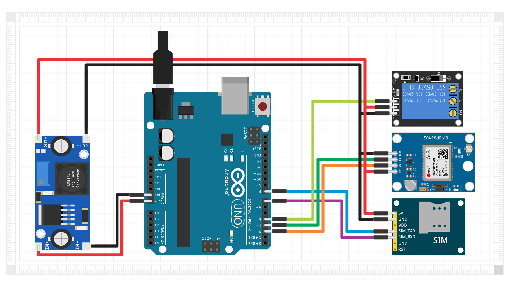

# README FILE EAGLE PCB GPS Tracker Mini

## Deskripsi Proyek
GPS Tracker Mini adalah proyek pelacak GPS berbasis **ATmega328P**, **SIM800C**, dan **Quectel L80 GNSS**. Proyek ini memungkinkan pelacakan lokasi secara real-time dengan komunikasi GSM/GPRS.

### Fitur Utama:
- **Pelacakan GPS:** Menggunakan modul **Quectel L80** untuk mendapatkan koordinat lokasi secara akurat.
- **Koneksi GSM:** Memanfaatkan modul **SIM800C** untuk mengirimkan data lokasi melalui SMS atau server berbasis GPRS.
- **Microcontroller ATmega328P:** Sebagai pusat kendali dari perangkat.
- **Slot MicroSD:** Untuk menyimpan log data lokasi jika koneksi tidak tersedia.
- **Konektor U.FL:** Untuk penggunaan antena eksternal pada modul GSM.

## Skema dan Desain PCB
Desain perangkat ini dibuat menggunakan **Eagle PCB** dan terdiri dari dua file utama:
- **Schematic:** [`GPS TRACKER MINI.sch`](./GPS%20TRACKER%20MINI.sch)
- **PCB Layout:** [`GPS TRACKER MINI.brd`](./GPS%20TRACKER%20MINI.brd)

## Skema Kalau Pakai Arduino Uno dan GPS NEO

## Bill of Materials (BOM)
Berikut adalah daftar komponen utama yang digunakan dalam proyek ini:

| Qty | Value | Device | Package | Parts |
|----|------|--------|---------|-------|
| 1  | ATMEGA328P-MU | ATMEGA328P-MU | QFN-32 | U1 |
| 1  | SIM800C | SIM800C | LCC-42 | U2 |
| 1  | L80_GNSS_MODULE | L80 GNSS Module | Custom | U3 |
| 1  | 4050D | Hex Buffer | SO16 | IC1 |
| 1  | LP298-33 | LDO Regulator 3.3V | SOT23-5L | IC2 |
| 1  | MICROSD | MicroSD Card Slot | MICROSD | X1 |
| 1  | ZD-SOD123 | 5.1V Zener Diode | SOD123 | ZD1 |
| 4  | 0.1uF | Capacitor | C0603 | C3, C15, C19, C21 |
| 2  | 100uF | Capacitor | B/3528-21R | C4, C5 |
| 1  | 10K | Resistor | R0603 | R1 |
| 1  | CSTCE16M0V53MU | Ceramic Resonator 16MHz | CSTCE16M0V53 | Y1 |
| 1  | SIM8051-6-0-14-01-X | Nano SIM Card Connector | SMT | J1 |
| 1  | CON-HIROSE-COAXIAL-U.FL | U.FL Connector | SMT | GSM |
| 1  | LED (Red) | Indicator | LED0805 | ACT |
| 1  | LED (Blue) | Indicator | LED0805 | LED4 |

## Instalasi dan Penggunaan
1. **Flash Firmware** ke ATmega328P menggunakan Arduino IDE atau PlatformIO.
2. **Sambungkan Antena** ke konektor U.FL untuk sinyal GSM lebih baik.
3. **Masukkan Kartu SIM** dan pastikan memiliki paket data aktif.
4. **Gunakan Software** untuk membaca koordinat GPS yang dikirim via SMS atau HTTP POST.

## Pemesanan PCB & Donasi
Jika kamu ingin membeli PCB dari proyek ini atau mendukung pengembangannya, silakan hubungi saya melalui WhatsApp:  
📲 **[085738244251](https://wa.me/6285738244251)**

Atau bisa juga berdonasi melalui:  

## Lisensi
Proyek ini berlisensi **MIT License**, artinya bebas digunakan dan dimodifikasi, namun tetap mencantumkan atribusi kepada pembuat asli.

---
Jika ada pertanyaan atau saran, jangan ragu untuk menghubungi saya melalui GitHub atau media sosial lainnya!
